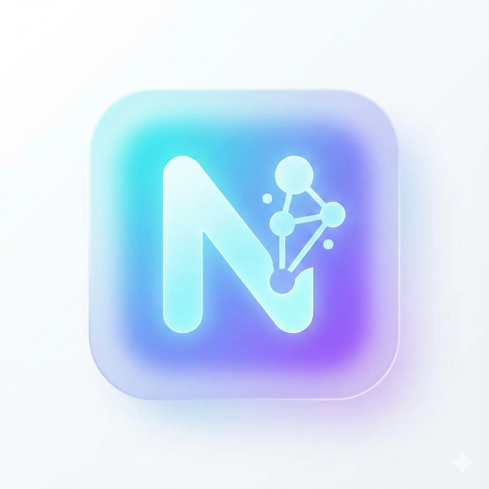

# Niko Mobile App

Niko, Android cihazlar için geliştirilmiş, sesli komutlarla çalışan kişisel bir yapay zeka asistanıdır. Gelişmiş ses tanıma özellikleri ve yapay zeka entegrasyonu sayesinde telefonunuzu dokunmadan kontrol etmenizi sağlar.

## Özellikler

- **Sesli Sohbet:** Niko ile doğal dilde konuşabilir, sorular sorabilir ve AI tabanlı cevaplar alabilirsiniz.
- **Arama Yönetimi:**
  - Rehberdeki kişileri ismen arama ("Ahmet'i ara").
  - Son gelen veya son aranan numarayı geri arama.
- **WhatsApp Entegrasyonu:**
  - Gelen WhatsApp mesajlarını sesli okuma.
  - Mesajlara sesli komutla otomatik cevap verme.
- **Sesli Yanıt:** Metin-Konuşma (TTS) motoru veya yüksek kaliteli AI sesleri (Edge-TTS) ile Niko size sesli olarak cevap verir.
- **Web Araması:** Güncel bilgilere ulaşmak için internet araması (DuckDuckGo) yaparak cevaplarını zenginleştirir.
- **Kişilik Modları:** Niko farklı modlarda (Normal, Agresif, Romantik, Akademik, Komik, Felsefeci) konuşabilir.
- **Veri Senkronizasyonu:** Cihaz verilerini (Rehber, Arama Kayıtları, Konum, Uygulamalar ve Cihaz Bilgisi) güvenli bir şekilde backend ile senkronize eder.
- **Gelişmiş Sohbet Geçmişi:** Mesaj geçmişini arama, tek tek silme ve kopyalama özellikleriyle yönetmenize olanak tanır.
- **Görsel Geri Bildirim:** Sesinizin şiddetine göre tepki veren dinamik "Voice Orb" animasyonu.

## Kullanım Rehberi

Niko'yu kullanmaya başlamak ve onunla etkileşime geçmek oldukça doğaldır:

1.  **Başlatma:** Uygulamayı açtığınızda merkezde bulunan dinamik **Voice Orb** sizi karşılar.
2.  **Etkinleştirme:** "Niko" diyerek seslenin veya ekrandaki mikrofon simgesine dokunarak dinleme modunu aktif hale getirin.
3.  **Komut Verme:** Orb parlamaya ve sesinize göre dalgalanmaya başladığında isteğinizi söyleyin.
    - _"Ali'yi ara"_
    - _"Atatürk kimdir?"_
    - _"Atatürk kaç yılında öldü?"_
    - _"Atatürk kaç yılında doğmuştur?"_
4.  **Geri Bildirim:** Niko, talebinizi işledikten sonra hem sesli olarak yanıt verir hem de görsel animasyonlarla etkileşimi sürdürür.

## Kullanılabilir Komutlar

Niko aşağıdaki sesli komutları anlayabilir ve yerine getirebilir:

### 👤 Kimlik ve Sohbet

- **Tanışma:** "Adın ne?", "Kimsin?", "Kendini tanıt"

### 📞 Arama ve İletişim

- **Arama:** "[İsim] ara" (Örn: "Ahmet'i ara")
- **Son Çağrılar:** "Son gelen", "Son aranan"
- **WhatsApp:**
  - "Whatsapp oku" (Son gelen mesajı sesli okur)
  - "Whatsapp cevap [Mesaj]" (Son mesaja otomatik veya belirtilen cevabı verir)
  - "Whatsapp'a bak", "Mesajlarımı oku"

### 📅 Zaman ve Tarih

- **Saat:** "Saat kaç?", "Saati söyle"
- **Tarih:** "Tarih", "Bugün günlerden ne", "Hangi gündeyiz"

### 🛠 Araçlar ve Sistem

- **Kamera:** "Kamera aç", "Fotoğraf çek", "Resim çek"
- **Ayarlar:** "Ayarları aç", "Sistem ayarları"
- **Wi-Fi:** "Wifi aç/kapat", "İnterneti aç/kapat"
- **Bluetooth:** "Bluetooth aç/kapat", "Bluetooth'u devre dışı bırak"
- **Parlaklık:** "Parlaklığı arttır/azalt", "Işığı kıs/aç", "Parlaklığı yükselt/düşür"

### 🎵 Medya ve Müzik (Spotify vb.)

- **Oynatma:** "Müziği başlat/çal", "Şarkıyı oynat/devam et", "Spotify aç"
- **Durdurma:** "Müziği durdur/duraklat", "Şarkıyı kapat/kes"
- **Değiştirme:** "Sonraki şarkı/parça", "Önceki şarkı/parça", "Şarkıyı geç/atla", "Sıradaki şarkı"

### ⏰ Alarm ve Hatırlatıcı

- **Alarm:**
  - "10 dakika sonra alarm"
  - "Sabah 7'ye alarm kur"
  - "Alarmları göster" (Saat anlaşılamazsa)
- **Hatırlatıcı:**
  - "Yarın hatırlat", "Bana anımsat"
  - "Akşam 8'de hatırlat"
  - "Hatırlatıcı ekle"

### 📜 Sohbet Geçmişi

- **Görüntüleme:** "Geçmişi aç/göster", "Sohbet geçmişini oku"
- **Yönetim:** "Geçmişi temizle/sil", "Geçmişi kapat"
- **İşlemler:** Mesajlara tıklayarak kopyalayabilir, uzun basarak tek tek silebilirsiniz.

## Kullanılan Teknolojiler

- Java (Android Native)
- Android Speech Recognizer & TextToSpeech
- NotificationListenerService (WhatsApp entegrasyonu için)
- HTTP URL Connection (Cloudflare Tunnel aracılığıyla AI iletişimi)
- FastAPI & Uvicorn (Python tabanlı Backend)
- Ollama (LLM Sunucusu - RefinedNeuro/RN_TR_R2)
- Edge-TTS (Yüksek kaliteli ses sentezi)
- DuckDuckGo Search (Web araması desteği)
- Base64 Audio Streaming (Sesli yanıtlar için)

## Tasarım ve İkonlar

Uygulama için hazırlanan logo/ikon çalışmaları ve referans görseller:

|                        Önizleme                        | Dosya Adı               |
| :----------------------------------------------------: | :---------------------- |
|  | `icon_candidate_01.png` |
|  | `icon_candidate_02.png` |
|  | `icon_candidate_03.png` |
|  | `icon_candidate_04.png` |
|    | `icon_reference.jpeg`   |

## Proje Dosya Yapısı

Proje içerisindeki temel dosyalar ve görevleri şunlardır:

- **`MainActivity.java`**: Uygulamanın beyni. Ses tanıma, metin okuma (TTS), API istekleri ve WhatsApp bildirim dinleme servislerini yönetir.
- **`AndroidManifest.xml`**: Uygulamanın kimliği. Gerekli izinleri (internet, mikrofon, kişilere erişim vb.) ve servisleri (NotificationListener) tanımlar.
- **`activity_main.xml`**: Ana ekran tasarımı. Voice Orb animasyonunu ve mikrofon butonunu içeren kullanıcı arayüzü (UI) dosyasıdır.
- **`orb_gradient.xml`**: Ses asistanının "gözü" olan Voice Orb için kullanılan radyal gradyan çizimidir.
- **`orb_halo.xml`**: Voice Orb'un etrafındaki yumuşak parıltı (halo) efektini sağlayan çizim dosyasıdır.
- **`mic_button.xml`**: Mikrofon butonunun görsel stilini belirleyen çizim dosyasıdır.
- **`icons/`**: Uygulama ikon adaylarını ve referans görselleri içeren klasördür.

## Yakında Eklenecekler

- [ ] Daha gelişmiş doğal dil işleme (NLP) yetenekleri.
- [ ] Özelleştirilebilir arayüz temaları ve renk seçenekleri.
- [x] Spotify ve diğer müzik çalarlar için kontrol desteği.
- [x] Çevrimdışı (Offline) basit komut desteği.
- [x] Hatırlatıcı ve alarm kurma özellikleri.
- [x] Sistem ayarları kontrolü (Wi-Fi, Bluetooth, Parlaklık vb. aç/kapa).
- [ ] Çoklu dil desteği (İngilizce, Almanca vb.).
- [ ] Hava durumu ve güncel haberler için sesli özet.
- [x] Sohbet Geçmişi.
- [ ] Chat arayüzü.
- [ ] Developer için debug ekranı.
- [ ] Kayıt/Giriş ekranı ve sistemi.

## İletişim

Geliştirici ile iletişime geçmek için proje sayfasını ziyaret edebilirsiniz.
